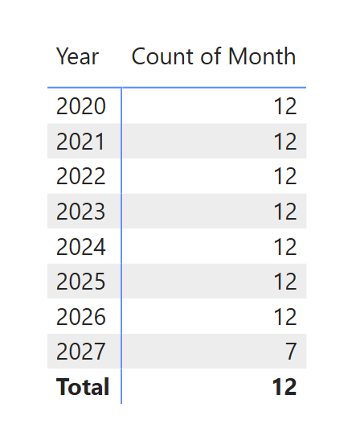

# Jason Jeannette – Data Visualization Portfolio

This portfolio showcases interactive dashboards built with Power BI and Tableau. Each project is based on real-world scenarios and designed to highlight data storytelling, dashboard design, and insight generation.

## Power BI Projects

### 🔹 Sales Performance Dashboard
**Focus:** Regional trends, product category KPIs  
**Data:** Sample sales dataset  
📁 [Download.pbix](PowerBI/SalesReport/SalesReport.pbix)  
📊 [View Live Dashboard](https://app.powerbi.com/reportEmbed?reportId=437cef09-48da-41b0-a87d-7dd2b8f77b3b&autoAuth=true&ctid=eccf81a1-6a96-42b8-93ed-309f056376bb)

### 🔹 Sales Performance Dashboard
**Focus:** Regional trends, product category KPIs  
**Data:** Sample sales dataset  
📁 [Download.pbix](PowerBI/SalesReport/SalesReport.pbix)  

## Tableau Projects

### 🔹 Sales Performance Dashboard
**Focus:** Regional trends, product category KPIs  
**Data:** Sample sales dataset  
📁 [Download.tb?](PowerBI/SalesReport/SalesReport.pbix)  

### 🔹 Sales Performance Dashboard
**Focus:** Regional trends, product category KPIs  
**Data:** Sample sales dataset  
📁 [Download.tb?](PowerBI/SalesReport/SalesReport.pbix)  

